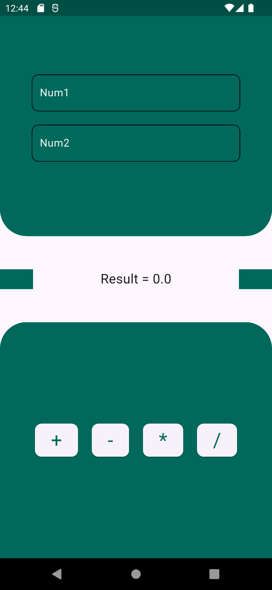

# 📱 Calculator App

A simple and clean calculator app built with **Flutter**. It allows users to perform basic arithmetic operations: addition, subtraction, multiplication, and division.

## ✨ Features

- Add, subtract, multiply, and divide two numbers.
- Instant result updates using **Cubit** (from flutter_bloc).
- Error handling for division by zero with a friendly SnackBar message.
- Clean and modern UI.

## 📷 Screenshots

  

## 🛠️ Built With

- **Flutter** – For building cross-platform mobile UI.
- **flutter_bloc** – For simple and effective state management.

## 🚀 Getting Started

### Prerequisites
- Flutter SDK installed  
- Dart enabled  
- An IDE like VS Code or Android Studio  

### Installation
1. Clone the repo:  
   `git clone https://github.com/rababhamdyy/calculator_app.git`

2. Navigate to the project directory:  
   `cd calculator_app`

3. Get dependencies:  
   `flutter pub get`

4. Run the app:  
   `flutter run`

## Folder Structure
- `lib/`  
  ├── `cubits/` – Contains the `CalculatorCubit`  
  ├── `widgets/` – Custom widgets like number input and buttons  
  ├── `views/` – Main screen (`HomeView`)  
  └── `main.dart` – Entry point
